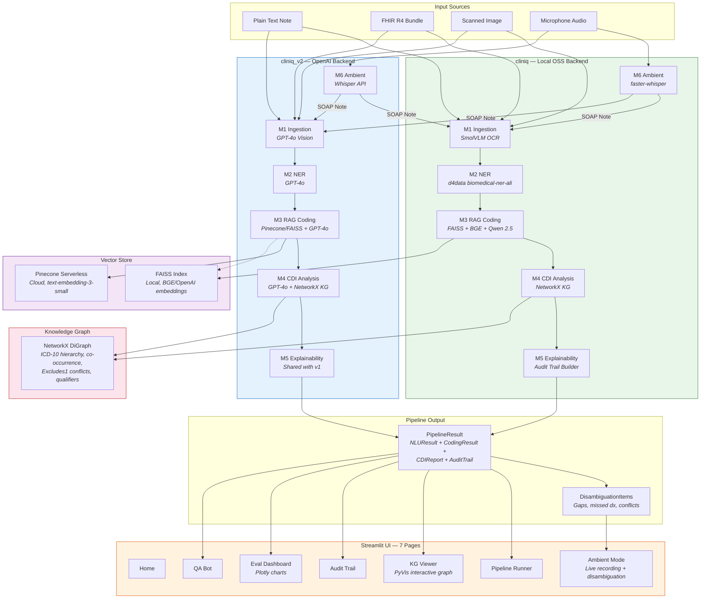
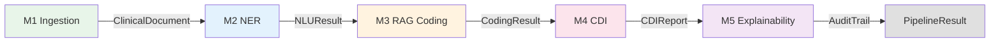

# ClinIQ — Agentic Clinical Coding & CDI Intelligence Platform

An end-to-end clinical NLP platform that ingests clinical notes, extracts medical entities with negation detection, suggests ICD-10 codes via RAG, runs CDI analysis to flag documentation gaps and missed diagnoses, and produces a full explainability audit trail. Ships with two backends: **v1** (fully local OSS models) and **v2** (OpenAI API), plus an ambient listening mode for real-time encounter documentation.

## Architecture



## Features

- **Dual backend** — fully local OSS models (v1) or OpenAI API (v2), selectable at startup
- **Multi-modal ingestion** — plain text, FHIR R4 bundles, and OCR'd clinical images
- **Biomedical NER** — entity extraction with negation detection and qualifier capture
- **RAG-based ICD-10 coding** — vector retrieval, reranking, and LLM reasoning with structured rationale
- **CDI analysis** — knowledge-graph-driven gap detection, co-occurrence missed diagnoses, Excludes1 conflict checks, and physician query generation
- **Explainability** — per-stage audit trail with timing, chain-of-thought traces, evidence span linkage, and retrieval logs
- **Ambient listening mode** — real-time encounter recording, auto-generated SOAP notes, documentation gap detection, missed diagnosis flagging, and coding disambiguation with provider review workflow
- **Cloud vector DB** — optional Pinecone serverless as alternative to local FAISS (v2 backend)
- **7-page Streamlit UI** — pipeline runner, interactive KG viewer, audit trail, eval dashboard, QA bot, and ambient mode
- **Gold standard evaluation** — 10 synthetic clinical cases with LLM-as-judge scoring

## Quick Start

### Prerequisites

- Python 3.10+
- ~4 GB disk for model downloads (v1 local backend, first run)
- OpenAI API key (v2 backend only)
- Pinecone API key (optional, for cloud vector search)

### Install

```bash
git clone https://github.com/praveenjoshi01/Agentic-Clinical-Coding-CDI-Assistant.git
cd "Clinical Documentation Integrity"

# Install in editable mode
pip install -e ".[dev]"

# Download spaCy model for negation detection
python -m spacy download en_core_web_sm
```

### Run the UI

```bash
streamlit run ui/app.py
```

On startup, choose your backend:
- **Skip** — use local OSS models (no API key needed, ~4 GB model download on first run)
- **Connect with OpenAI** — enter your OpenAI API key, optionally add a Pinecone API key for cloud vector search

### Run the CLI Demo

```bash
# Quick mode — skips LLM coding, runs in ~10 seconds
python scripts/demo.py --quick

# Full pipeline — includes RAG coding with Qwen LLM (~20 min/scenario on CPU)
python scripts/demo.py
```

### Run Tests

```bash
# All tests
pytest cliniq/tests/ -v

# With coverage
pytest cliniq/tests/ --cov=cliniq --cov-report=term-missing
```

### Set Up Pinecone (Optional)

```bash
# Build the v2 FAISS index (required for v2 backend with FAISS)
python scripts/build_v2_index.py --api-key YOUR_OPENAI_KEY

# Or populate Pinecone (required for v2 backend with Pinecone)
python scripts/populate_pinecone_index.py \
    --openai-api-key YOUR_OPENAI_KEY \
    --pinecone-api-key YOUR_PINECONE_KEY

# Check index status
python scripts/populate_pinecone_index.py --pinecone-api-key YOUR_KEY --check
```

## Tech Stack

### v1 — Local OSS Models

| Component | Model | Size | Purpose |
|-----------|-------|------|---------|
| NER | `d4data/biomedical-ner-all` | 440M | Clinical entity extraction |
| Embedder | `BAAI/bge-small-en-v1.5` | 130M | ICD-10 code retrieval (FAISS) |
| Reranker | `cross-encoder/ms-marco-MiniLM-L-6-v2` | 80M | Candidate reranking |
| Reasoning LLM | `Qwen/Qwen2.5-1.5B-Instruct` | 3B | Code selection + physician queries |
| OCR/Vision | `HuggingFaceTB/SmolVLM-256M-Instruct` | 500M | Image-based note ingestion |
| Transcription | `faster-whisper` (CTranslate2) | ~500M | Audio-to-text for ambient encounters |
| Knowledge Graph | NetworkX DiGraph | — | CDI gap/conflict/co-occurrence rules |

### v2 — OpenAI API

| Component | Model | Purpose |
|-----------|-------|---------|
| NER + Reasoning + CDI | `gpt-4o` | Entity extraction, code selection, physician queries |
| Embeddings | `text-embedding-3-small` | ICD-10 code retrieval (FAISS or Pinecone) |
| Transcription | `gpt-4o-mini-transcribe` | Audio-to-text for ambient encounters |
| Vision/OCR | `gpt-4o` | Image-based note ingestion |
| Vector DB | Pinecone serverless (optional) | Cloud-hosted ICD-10 code retrieval |

## Pipeline Stages



### M1 — Ingestion
Detects input modality (plain text, FHIR bundle, or clinical image), extracts the narrative, and normalizes into a `ClinicalDocument` with metadata and confidence score.

### M2 — NER
Extracts clinical entities, maps raw labels to semantic categories (diagnosis, procedure, medication, anatomical site, lab value), and applies negation detection (e.g., "denies chest pain" -> negated).

### M3 — RAG Coding
For each non-negated diagnosis/procedure entity: retrieves top-K ICD-10 candidates via vector search, reranks, and selects the best code with structured reasoning. Codes are sequenced into principal/secondary/complications.

### M4 — CDI Analysis
Builds a NetworkX knowledge graph with ICD-10 hierarchy, co-occurrence weights, Excludes1 conflict rules, and required qualifiers. Queries the KG to find documentation gaps, code conflicts, and missed diagnoses. Generates physician queries for each gap.

### M5 — Explainability
Wraps each pipeline stage with timing and trace capture. Links ICD-10 codes to supporting text spans. Captures chain-of-thought traces from LLM responses. Produces a complete `AuditTrail`.

### M6 — Ambient Listening
Records physician-patient encounters, transcribes audio, and generates SOAP notes. The generated note is fed through the full M1-M5 pipeline. CDI findings are surfaced as disambiguation items with an accept/dismiss review workflow.

## UI Pages

| Page | Description |
|------|-------------|
| **Home** | Landing page with project overview, architecture diagram, and navigation |
| **Pipeline Runner** | Upload clinical documents or select demo cases, run the full pipeline, view NER annotations, ICD-10 codes, and CDI findings across four tabs |
| **Knowledge Graph** | Interactive PyVis visualization with color-coded nodes (green=documented, amber=needs query, red=conflict) and CDI sidebar |
| **Audit Trail** | Per-stage decision trace with timing, chain-of-thought reasoning, retrieval logs, and evidence spans |
| **Eval Dashboard** | Radar and bar charts comparing actual vs. target metrics with per-module pass/fail badges |
| **QA Bot** | Chat interface with pre-seeded verified answers, template-based patient answers, and optional LLM fallback |
| **Ambient Mode** | Live encounter recording or demo playback with four result tabs: Transcript, Generated Note, Clinical Findings, and Disambiguation & Review |

## Demo Cases

### Pipeline Runner

| Case | Patient | Key Findings |
|------|---------|--------------|
| Case 004 | 68M, CKD stage 3 + Hypertension | 19 entities, negation detection on chest pain/edema, ICD-10 sequencing |
| Case 010 | 75M, CHF (LVEF 30%) + Chronic AFib | 34 entities, multiple diagnoses and medications, CDI gap analysis |
| Case 001 | Diabetes + Neuropathy | FHIR bundle ingestion, entity extraction from structured data |

### Ambient Encounters

| Encounter | Scenario | Disambiguation Items |
|-----------|----------|---------------------|
| 001 | Primary care follow-up: 68M with CKD, HTN, DM, fatigue, bilateral edema | 9 items across gap, missed dx, conflict, ambiguity |
| 002 | Urgent care: 52M with acute chest pain, substernal pressure, left arm radiation | Cardiac-focused gaps and differential diagnosis items |

## Project Structure

```
cliniq/                          # v1 — Local OSS backend
├── config.py                    # Model registry, paths, hyperparameters
├── model_manager.py             # Lazy model loading singleton
├── pipeline.py                  # End-to-end orchestrator
├── modules/
│   ├── m1_ingest.py             # Multi-modal ingestion (text, FHIR, image)
│   ├── m2_nlu.py                # NER + negation detection
│   ├── m3_rag_coding.py         # FAISS retrieval -> rerank -> Qwen reasoning
│   ├── m4_cdi.py                # CDI agent (KG queries + physician queries)
│   ├── m5_explainability.py     # Audit trail builder, evidence linking
│   └── m6_ambient.py            # Ambient transcription, SOAP generation
├── models/                      # Pydantic schemas (shared by both backends)
├── rag/                         # FAISS index, BGE retriever, reranker
├── knowledge_graph/             # NetworkX KG builder + querier
├── evaluation/                  # LLM-as-judge evaluation
├── data/                        # ICD-10 catalog + gold standard test cases
└── tests/                       # pytest test suite

cliniq_v2/                       # v2 — OpenAI API backend
├── api_client.py                # OpenAI client singleton
├── pinecone_client.py           # Pinecone client singleton
├── config.py                    # OpenAI model registry + Pinecone config
├── pipeline.py                  # End-to-end orchestrator (OpenAI)
├── modules/                     # M1-M6 reimplemented with GPT-4o
├── rag/
│   ├── base.py                  # BaseRetriever Protocol
│   ├── retriever.py             # FAISSRetriever (OpenAI embeddings)
│   ├── pinecone_retriever.py    # PineconeRetriever
│   ├── factory.py               # get_retriever() factory
│   └── build_index.py           # FAISS index builder (OpenAI embeddings)
└── evaluation/                  # GPT-4o judge

ui/                              # Streamlit web interface
├── app.py                       # Entry point, API key gate, navigation
├── pages/                       # 7 pages (home, pipeline, KG, audit, eval, QA, ambient)
├── components/                  # Reusable UI components (theme, cards, graphs)
├── helpers/                     # Backend selection helpers
└── demo_data/                   # Pre-computed results and demo Q&A bank

scripts/
├── demo.py                      # CLI demo (2 scenarios)
├── build_v2_index.py            # Build v2 FAISS index with OpenAI embeddings
├── populate_pinecone_index.py   # Populate Pinecone with ICD-10 embeddings
├── generate_test_data.py        # Gold standard data generator
├── generate_test_images.py      # Test image generator
├── precompute_demo.py           # Pre-compute pipeline results for UI
└── precompute_ambient.py        # Pre-compute ambient demo data
```

## License

MIT
